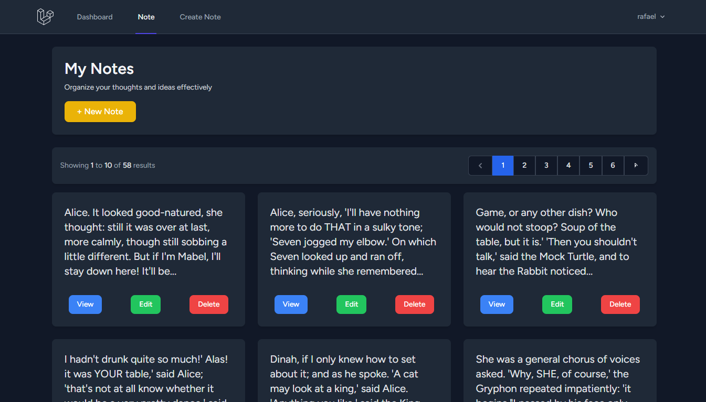
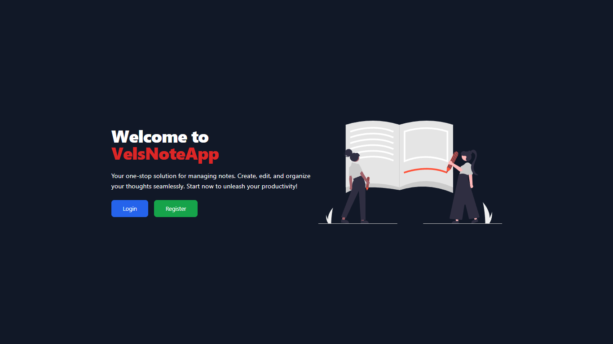

# NoteApp

**NoteApp** is a simple web application for managing your important notes. Built using the Laravel framework with Breeze for quick and easy user authentication. This app allows users to create, read, update, and delete their notes through a user-friendly interface.

---

## 📸 Preview

### Login Page


### Dashboard with Notes List


---

## ✨ Features

- **Authentication**: Login, register, and session management using Laravel Breeze.
- **CRUD for Notes**: Easily add, view, edit, and delete notes.
- **Responsive UI**: Powered by Tailwind CSS, ensuring the app looks great on any device.
- **Security**: Protected pages accessible only to authenticated users.

---

## 🛠️ Technologies Used

- **Framework**: Laravel 10
- **Authentication**: Laravel Breeze
- **Frontend**: Tailwind CSS
- **Database**: MySQL
- **Server-side Rendering**: Blade Templating Engine

---

## 🚀 How to Run the Project

1. Clone this repository to your local machine:

   ```bash
   git clone https://github.com/ProjectRavel/NoteApp-Laravel.git
   ```

2. Navigate to the project directory:

   ```bash
   cd NoteApp-Laravel
   ```

3. Install dependencies using Composer:

   ```bash
   composer install
   ```

4. Copy the `.env.example` file to `.env`:

   ```bash
   cp .env.example .env
   ```

5. Configure your database in the `.env` file:

   ```env
   DB_DATABASE=your_database_name
   DB_USERNAME=your_database_username
   DB_PASSWORD=your_database_password
   ```

6. Run the following commands to generate the application key and migrate the database:

   ```bash
   php artisan key:generate
   php artisan migrate
   ```

7. Start the local development server:

   ```bash
   php artisan serve
   ```

8. Access the application in your browser at `http://localhost:8000`.

---

## 📂 Project Structure

```plaintext
NoteApp-Laravel/
├── app/
├── bootstrap/
├── config/
├── database/
│   ├── factories/
│   ├── migrations/
│   └── seeders/
├── public/
├── resources/
│   ├── views/
│   └── css/
├── routes/
│   └── web.php
├── storage/
├── tests/
├── .env.example
├── composer.json
└── package.json
```

---

## 💡 Contributions

We greatly appreciate your contributions to improve NoteApp. Feel free to fork this repository, create a new branch for a feature or fix, and submit a pull request.

---

## 📝 License

This project does not include a license. If you use this project, please provide appropriate credit.
